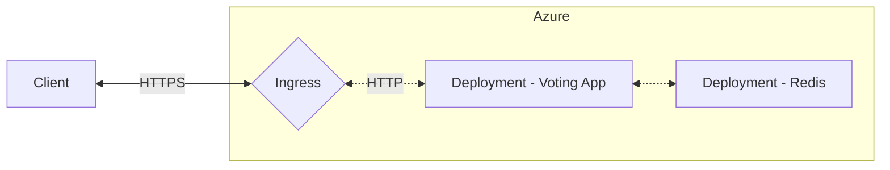
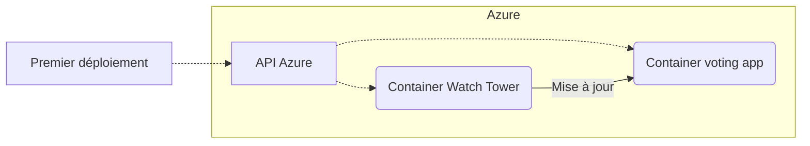

# Brief 7 - Continuous Delivery
## Infrastructure déployée

L'infrastructure sera la même que celle déployée au brief 6 :

> Pour déployer cette infrastructure, lire le [README.md](https://github.com/DevSoleo/simplon-brief-6/blob/main/README.md#d%C3%A9ploiement) du brief 6.
## Méthode 1 : Watch Tower

:::danger
Cette méthode ne correspond pas aux exigences du brief.
:::

### Pipeline

Ce solution permet de mettre à jour l'application sans avoir à attendre un délai prédéfini. De cette manière, l'application se met à jour automatiquement lorsque la watch-tower détecte une mise à jour de l'image sur Docker Hub.

Elle ne nécessite pas de pipeline (réduction des côuts), c'est la plus simple à implémenter, et la plus facile à maintenir. En situation réelle c'est la solution à adopter.



### Pricing

A FAIRE

### Sources
L'idée d'utiliser une watchtower : https://www.digitalocean.com/community/tutorials/how-to-automatically-update-docker-container-images-with-watchtower-on-ubuntu-22-04#step-1-watching-an-externally-maintained-docker-image-using-docker-s-run-command

Documentation de watchtower : https://containrrr.dev/watchtower/

## Méthode 2 : Kubernetes

:::success
Cette méthode correspond aux exigences du brief.
:::

### Pipeline 
Avant l'éxécution du pipeline, l'infrastructure doit y être déployée au moins une première fois. 

Une fois déployée, l'appliation pourra être mise à jour via le pipeline suivant :
```mermaid
flowchart LR
    subgraph pipeline[Github Action]
        api[Version depuis l'API DockerHub] --> model[Modification du modèle k8s]
    end
    
    subgraph azure[Azure]
    model --> api_azure
    api_azure([API Azure]) -. Mets à jour l'image --> voting_app[Deployment - Voting App]
    
    end
```

Grâce à un `cron`, le pipeline s'éxécute à heures fixes (toutes les heures), lors de son éxécution, une requête à l'API de Docker Hub est faite afin de récupérer le numéro de version de l'image à déployer. Ce numéro de version est ensuite inscrit de le fichier `model.yml` qui est ensuite utilisé pour appliqué cette modification sur Azure.


### Pricing

Via [l'outil de calcul des tarifs](https://azure.microsoft.com/fr-fr/pricing/calculator/) fournit par Microsoft : 


Le choix de la catégorie de machine virtuelle, fait à l'aide de la [documentation d'Azure](https://azure.microsoft.com/fr-fr/pricing/details/virtual-machines/series/), s'est porté vers la série B, en effet c'est la série la plus adaptée pour de petites charges, c'est également la plus économique. Il existe aussi la série A mais elle reste cependant plus adaptée aux tests et au développement. 
De même pour le stockage, nous avons choisi un SSD E1 car se sont les moins chers pour l'espace de stockage dont nous avons réellement besoin, ils sont également plus rapides que des HDD.
